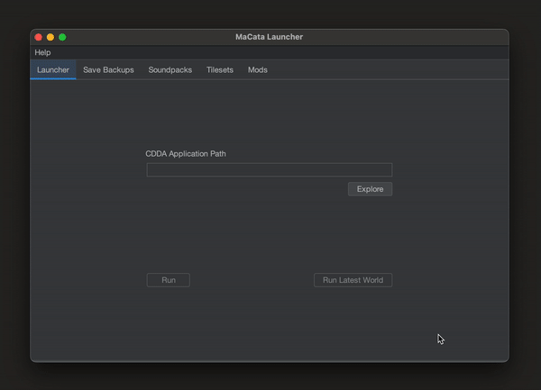

```
   _____         _________         __           .____                               .__                  
  /     \ _____  \_   ___ \_____ _/  |______    |    |   _____   __ __  ____   ____ |  |__   ___________ 
 /  \ /  \\__  \ /    \  \/\__  \\   __\__  \   |    |   \__  \ |  |  \/    \_/ ___\|  |  \_/ __ \_  __ \
/    Y    \/ __ \\     \____/ __ \|  |  / __ \_ |    |___ / __ \|  |  /   |  \  \___|   Y  \  ___/|  | \/
\____|__  (____  /\______  (____  /__| (____  / |_______ (____  /____/|___|  /\___  >___|  /\___  >__|   
        \/     \/        \/     \/          \/          \/    \/           \/     \/     \/     \/       
```

<p align="center">
    MaCata - A Cataclysm: DDA macOS Launcher
</p>

<p align="center">
    
</p>

---


## Requirements

MaCata requires Java 11 to run.

## Installation

Just put the `macatalauncher.jar` in some folder of your choice and double click!

## Features

### Current

- [x] Launch game & launch from last played world
- [x] Save management & backups
  - Custom save directory is located at `/<macata_launcher_folder>/saves`
  - Custom backups directory is located at `/<macata_launcher_folder>/backups`
- [x] Centralized data folder: put all your mods/tilesets/sounds into the launcher's custom data directory (made after the first launch of the game through the launcher), and they will get picked up by the game even if you later upgrade or swap CDDA binaries. 
  - No more having to move folders between `Cataclysm.app`s on each Experimental upgrade!
  - This shared data directory is located at `/<macata_launcher_folder>/userdir`
- [x] Soundpack management

### Planned

- [ ] Mod support (soon)
- [ ] Tileset support (soon)
- [ ] Automatic CDDA binary updates & backups

### Maybes

- [ ] Windows/Linux support
  - I want to focus mainly on macOS since there are already some excellent launchers for Windows and Linux already.
    - Having said that, given the current launcher architecture, I would like to think it wouldn't be terribly hard to support Linux and/or Windows. Just a couple of changes to the [launcher class](src/main/java/com/dazednconfused/catalauncher/launcher/CDDALauncherManager.java) maybe? PRs welcome!

## FAQ

### Why Yet Another Launcher?

Story time! [TL:DR](#TLDR) at the bottom:

A couple of years ago, during the pandemic, I discovered [Cataclysm - Dark Days Ahead](https://github.com/CleverRaven/Cataclysm-DDA). Being a zombie game and a survival game aficionado, upon finding one that scratched both itches in such a comprehensive way that I hadn't seen since [Project Zomboid](https://store.steampowered.com/app/108600/Project_Zomboid/), well... lets just say I got hooked immediately.

I started my CDDA journey on Windows, on which [remyroy's launcher](https://github.com/remyroy/CDDA-Game-Launcher) was an absolute boon for getting a newbie like me started. When I had found out it was no longer receiving updates, [I picked up its maintenance](https://github.com/DazedNConfused-/CDDA-Game-Launcher) in an effort to keep my main CDDA driver alive.

Other tools emerged soon afterwards, like the incredible [Catapult Launcher](https://github.com/qrrk/Catapult) which is doubly excellent for both providing Linux support and for being able to use it for [Cataclysm Bright Nights](https://github.com/cataclysmbnteam/Cataclysm-BN). 

Some time later, I shifted into using a Mac as my main development machine, and thus I started playing CDDA on it. Unfortunately for me though, I couldn't find any launcher that worked with the Mac version of the game! Remyroy's launcher is too specifically tailored for Windows for me to ever be able to add cross-platform support without having to completely rewrite the tool from scratch. As for Catapult, being developed in [Godot](https://godotengine.org/), I had high hopes I could make it work with a bit of elbow grease. Alas, I like to think I got pretty far, but I could never make it function completely (I never got the .dmg unpacking to work quite right on GDScript).

Defeated, I had resigned myself to waiting until someone, anyone, made a launcher that worked with Mac. I wasn't asking for much, just a tool that allowed me to manage my saves and could spare me the tedium of having to use bash scripts for automating the tasks. Until one day I snapped...


#### TL:DR

At the time of writing this, I haven't ever come across a launcher that worked with macOS.


### Why Java? If you were focusing on MacOS, wouldn't it have been better to write it as a native app?

I _am_ mainly a Java developer. Plus, Java has a humongous library collection for virtually every situation that could be conceived; and Swing is an incredibly boring & mature (both good things!) toolkit for GUI apps. What is not to love? ;)